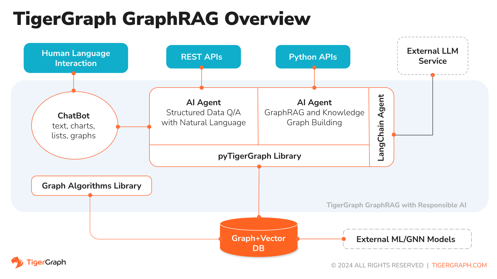
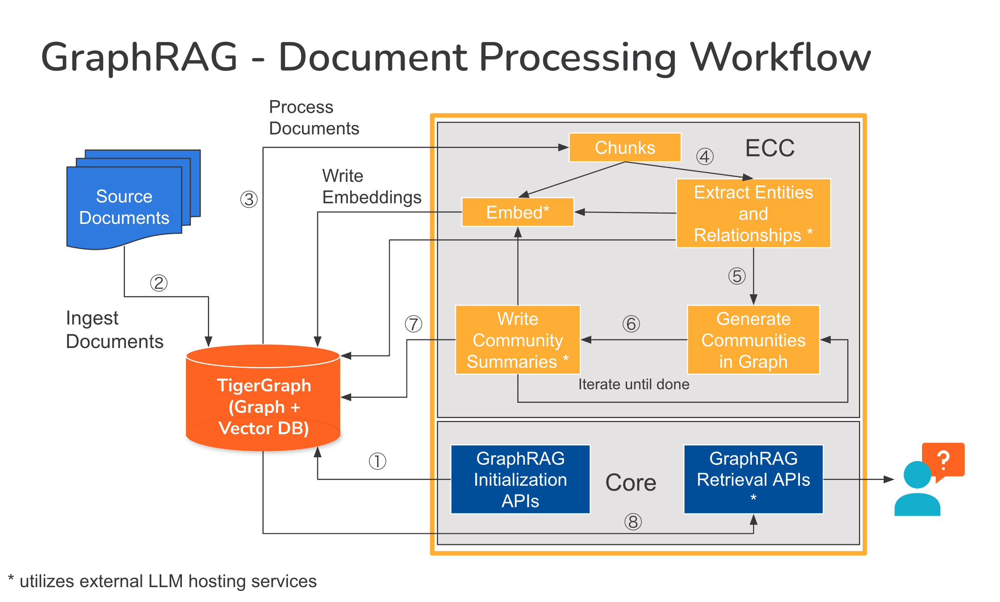
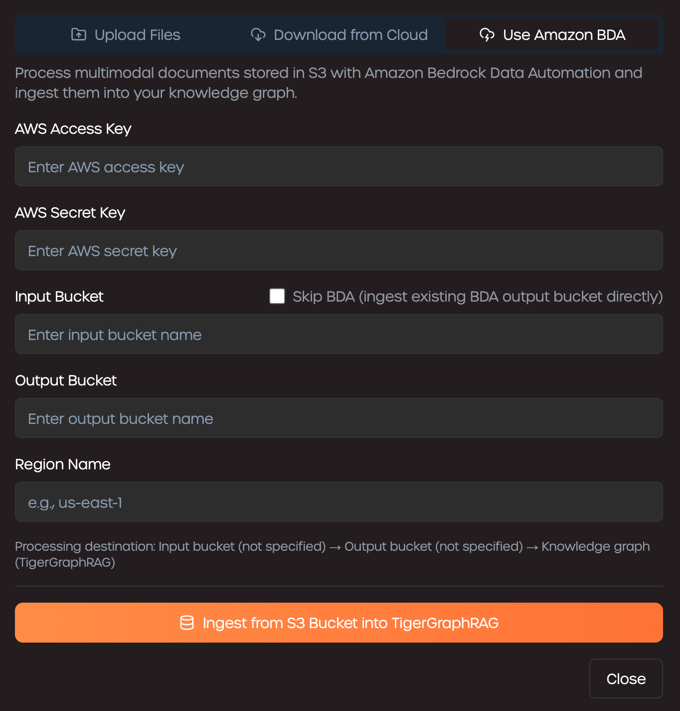

# TigerGraph GraphRAG

> ⚠️ **Disclaimer**  
> - **Supported Backend:** TigerGraph is the only Vector and Graph DB supported in this project. Hybrid Search is the officially retriever method supported at backend.  
> - **Limitations:** No official support is provided unless delivered through a Statement of Work (SOW) with the Solutions team. Customizations are customer-owned self-service to handle custom LLM service, prompt logic, UI integration, and pipeline orchestration. This project is provided "as is" without any warranties or guarantees.

## Table of Contents

- [Releases](#releases)
- [Overview](#overview)
  - [Nature Language Query](#nature-language-query)
  - [Knowledge Graph Query](#knowledge-graph-query)
- [Getting Started](#getting-started)
  - [Prerequisites](#prerequisites)
  - [Quick Start](#quick-start)
    - [Use TigerGraph Docker-Based Instance](#use-tigergraph-docker-based-instance)
    - [Use Pre-Installed TigerGraph Instance](#use-pre-installed-tigergraph-instance)
  - [Deploy GraphRAG Manually](#deploy-graphrag-manually)
    - [Manual Deploy of GraphRAG with Docker Compose](#manual-deploy-of-graphrag-with-docker-compose)
    - [Use Standalone TigerGraph instance (If preferred)](#use-standalone-tigergraph-instance-if-preferred)
    - [Manual Deploy of GraphRAG with Kubernetes](#manual-deploy-of-graphrag-with-kubernetes)
- [Use TigerGraph GraphRAG](#use-tigergraph-graphrag)
  - [Run Demo with Preloaded GraphRAG](#run-demo-with-preloaded-graphrag)
  - [Manually Build GraphRAG From Scratch](#manually-build-graphrag-from-scratch)
- [Document Ingestion for Knowledge Graph](#document-ingestion-for-knowledge-graph)
  - [Ingest Documents from the UI](#ingest-documents-from-the-ui)
    - [Local File Upload](#local-file-upload)
    - [Download from Cloud](#download-from-cloud)
    - [Use Amazon BDA](#use-amazon-bda)
  - [Ingest Documents via API](#ingest-documents-via-api)
- [More Detailed Configurations](#more-detailed-configurations)
  - [DB configuration](#db-configuration)
  - [GraphRAG configuration](#graphrag-configuration)
  - [Chat History Configuration](#chat-history-configuration)
  - [LLM provider configuration](#llm-provider-configuration)
    - [Supported parameters](#supported-parameters)
    - [Provider examples](#provider-examples)
    - [OpenAI](#openai)
    - [Google GenAI](#google-genai)
    - [GCP VertexAI](#gcp-vertexai)
    - [Azure](#azure)
    - [AWS Bedrock](#aws-bedrock)
    - [Ollama](#ollama)
    - [Hugging Face](#hugging-face)
    - [Groq](#groq)
- [Tuning Guideline](#tuning-guideline)
  - [Tune in the right order](#1-tune-in-the-right-order)
  - [Chunking](#2-chunking--get-the-granularity-right)
  - [Extraction](#3-extraction--make-the-graph-clean-before-tuning-retrieval)
  - [Retrieval](#4-retrieval--match-context-size-to-the-question)
  - [Prompts](#5-prompts--last-resort-biggest-leverage-when-the-rest-is-right)
  - [Performance / cost knobs](#6-performance--cost-knobs)
  - [A working tuning loop](#7-a-working-tuning-loop)
- [Customization and Extensibility](#customization-and-extensibility)
  - [Test Your Code Changes](#test-your-code-changes)
    - [Testing with Pytest](#testing-with-pytest)
    - [Test Code Change in Docker Container](#test-code-change-in-docker-container)
  - [Test Script Options](#test-script-options)
    - [Configure LLM Service](#configure-llm-service)
    - [Configure Testing Graphs](#configure-testing-graphs)
    - [Configure Weights and Biases](#configure-weights-and-biases)

---

## Releases
* **4/10/2026**: GraphRAG v1.3.0 released. Added an admin configuration UI with role-based access and per-graph chatbot LLM override, along with many other improvements and bug fixes. See [Release Notes](https://github.com/tigergraph/graphrag/releases/tag/v1.3.0) for details.
* **2/28/2026**: GraphRAG v1.2.0 released. Added Admin UI for graph initialization, document ingestion, and knowledge graph rebuild, along with many other improvements and bug fixes. See [Release Notes](https://github.com/tigergraph/graphrag/releases/tag/v1.2.0) for details.
* **9/22/2025**: GraphRAG is available now officially v1.1 (v1.1.0). AWS Bedrock support is completed with BDA integration for multimodal document ingestion. See [Release Notes](https://github.com/tigergraph/graphrag/releases/tag/v1.1.0) for details.
* **6/18/2025**: GraphRAG is available now officially v1.0 (v1.0.0). TigerGraph database is the only graph and vector storagge supported.
Please see [Release Notes](https://docs.tigergraph.com/tg-graphrag/current/release-notes/) for details.

---

## Overview



TigerGraph GraphRAG is an AI assistant that is meticulously designed to combine the powers of vector store, graph databases and generative AI to draw the most value from data and to enhance productivity across various business functions, including analytics, development, and administration tasks. It is one AI assistant with two core component services:
* A natural language assistant for Q&A with graph-powered solutions
* A knowledge graph builder for managing documents and graphs

You can interact with GraphRAG through the built-in chat interface and APIs. For now, your own LLM services (from OpenAI, Azure, GCP, AWS Bedrock, Ollama, Hugging Face and Groq.) are required to use GraphRAG, but in future releases you can use TigerGraph’s LLMs.

### Nature Language Query


When a question is posed in natural language, GraphRAG employs a novel three-phase interaction with both the TigerGraph database and a LLM of the user's choice, to obtain accurate and relevant responses.

The first phase aligns the question with the particular data available in the database. GraphRAG uses the LLM to compare the question with the graph’s schema and replace entities in the question by graph elements. For example, if there is a vertex type of `BareMetalNode` and the user asks `How many servers are there?`, the question will be translated to `How many BareMetalNode vertices are there?`. In the second phase, GraphRAG uses the LLM to compare the transformed question with a set of curated database queries and functions in order to select the best match. In the third phase, GraphRAG executes the identified query and returns the result in natural language along with the reasoning behind the actions.

Using pre-approved queries provides multiple benefits. First and foremost, it reduces the likelihood of hallucinations, because the meaning and behavior of each query has been validated.  Second, the system has the potential of predicting the execution resources needed to answer the question.

### Knowledge Graph Query


For inquiries cannot be answered with structured graph data, GraphRAG employs an AI chatbots with graph-augmented Knowledge Graph based on a user's own documents or text data. It builds a knowledge graph from source material and applies its unique variant of knowledge graph-based RAG (Retrieval Augmented Generation) to improve the contextual relevance and accuracy of answers to natural-language questions.

GraphRAG will also identify concepts and build an ontology, to add semantics and reasoning to the knowledge graph, or users can provide their own concept ontology. Then, with this comprehensive knowledge graph, GraphRAG performs hybrid retrievals, combining traditional vector search and graph traversals, to collect more relevant information and richer context to answer users’ knowledge questions.

Organizing the data as a knowledge graph allows a chatbot to access accurate, fact-based information quickly and efficiently, thereby reducing the reliance on generating responses from patterns learned during training, which can sometimes be incorrect or out of date.

[Go back to top](#top)

---

## Getting Started

### Prerequisites
* Docker + Docker Compose Plugin, or Kubernetes
* TigerGraph DB 4.2+.
* API key of your LLM provider. (An LLM provider refers to a company or organization that offers Large Language Models (LLMs) as a service. The API key verifies the identity of the requester, ensuring that the request is coming from a registered and authorized user or application.) Currently, GraphRAG supports the following LLM providers: OpenAI, Azure OpenAI, GCP, AWS Bedrock.


### Quick Start

#### Use TigerGraph Docker-Based Instance
Set your LLM Provider (supported `openai` or `gemini`) api key as environment variable LLM_API_KEY and use the following command for a one-step quick deployment with TigerGraph Community Edition and default configurations:
```
curl -k https://raw.githubusercontent.com/tigergraph/graphrag/refs/heads/main/docs/tutorials/setup_graphrag.sh | bash
```

The GraphRAG instances will be deployed at `./graphrag` folder and TigerGraph instance will be available at `http://localhost:14240`.
To change installation folder, use `bash -s -- <graphrag_folder> <llm_provider>` instead of `bash` at the end of the above command.

> Note: for other LLM providers, manually update `configs/server_config.json` accordingly and re-run `docker compose up -d`

#### Use Pre-Installed TigerGraph Instance
Similar to the above setup, and use the following command for a one-step quick deployment connecting to a pre-installed TigerGraph with default configurations:
```
curl -k https://raw.githubusercontent.com/tigergraph/graphrag/refs/heads/main/docs/tutorials/setup_graphrag_tg.sh | bash
```

The GraphRAG instances will be deployed at `./graphrag` folder and connect to TigerGraph instance at `http://localhost:14240` by default.
To change installation folder, TigerGraph instance location or username/password, use `bash -s -- <graphrag_folder> <llm_provider> <tg_host> <tg_port> <tg_username> <tg_password>` instead of `bash` at the end of the above command.

[Go back to top](#top)


### Deploy GraphRAG Manually
The GraphRAG services can be deployed manually using Docker Compose or Kubernetes with updated configurations for different use cases.

#### Manual Deploy of GraphRAG with Docker Compose

##### Step 1: Get docker-compose file
Download the [docker-compose.yml](https://raw.githubusercontent.com/tigergraph/graphrag/refs/heads/main/docs/tutorials/docker-compose.yml) file directly

The Docker Compose file contains all dependencies for GraphRAG including a TigerGraph database. If you want to use a separate TigerGraph instance, you can comment out the `tigergraph` section from the docker compose file and restart all services. However, please follow the instructions below to make sure your standalone TigerGraph server is accessible from other GraphRAG containers.

##### Step 2: Set up configurations

Next, download the following configuration files and put them in a `configs` subdirectory of the directory contains the Docker Compose file:
* [configs/server_config.json](https://raw.githubusercontent.com/tigergraph/graphrag/refs/heads/main/docs/tutorials/configs/server_config.json)
* [configs/nginx.conf](https://raw.githubusercontent.com/tigergraph/graphrag/refs/heads/main/docs/tutorials/configs/nginx.conf)

Here’s what the folder structure looks like:
```
    graphrag
    ├── configs
    │   ├── nginx.conf
    │   └── server_config.json
    └── docker-compose.yml
```

##### Step 3: Adjust configurations

Edit `llm_config` section of `configs/server_config.json` and replace `<YOUR_LLM_API_KEY>` to your own LLM_API_KEY for the LLM provider. 
 
> If desired, you can also change the model to be used for the embedding service and completion service to your preferred models to adjust the output from the LLM service.

##### Step 4: Configure Logging Level in Dockerfile (Optional)

To configure the logging level of the service, edit the Docker Compose file.

**By default, the logging level is set to "INFO".**

```console
ENV LOGLEVEL="INFO"
```

This line can be changed to support different logging levels.

**The levels are described below:**

| Level | Description |
| --- | --- |
| `CRITICAL` | A serious error. |
| `ERROR` | Failing to perform functions. |
| `WARNING` | Indication of unexpected problems, e.g. failure to map a user’s question to the graph schema. |
| `INFO` | Confirming that the service is performing as expected. |
| `DEBUG` | Detailed information, e.g. the functions retrieved during the `GenerateFunction` step, etc. |
| `DEBUG_PII` | Finer-grained information that could potentially include `PII`, such as a user’s question, the complete function call (with parameters), and the LLM’s natural language response. |
| NOTSET | All messages are processed. |

##### Step 5: Start all services

Now, simply run `docker compose up -d` and wait for all the services to start.

> Note: `graphrag` container will be down if TigerGraph service is not ready. Log into the `tigergraph` container, bring up tigergraph services and rerun `docker compose up -d` should resolve the issue.

##### Step 6: Stop all services (when needed)

Run command `docker compose down` and wait for all the service containers to stopped and removed.

[Go back to top](#top)

#### Use Standalone TigerGraph instance (If preferred)

> **_Note:_** Vector feature is available in both TigerGraph Community Edition 4.2.0+ and Enterprise Edition 4.2.0+.

If you prefer to start a TigerGraph Community Edition instance without a license key, please make sure the container can be accessed from the GraphRAG containers by add `--network graphrag_default`:
```
docker run -d -p 14240:14240 --name tigergraph --ulimit nofile=1000000:1000000 --init --network graphrag_default -t tigergraph/community:4.2.2
```

> Use **tigergraph/tigergraph:4.2.2** if Enterprise Edition is preferred.
> Setting up **DNS** or `/etc/hosts` properly is an alternative solution to ensure contains can connect to each other.
> Or modify`hostname` in `db_config` section of `configs/server_config.json` and replace `http://tigergraph` to your tigergraph container IP address, e.g., `http://172.19.0.2`. 

Check the service status with the following commands:
```
docker exec -it tigergraph /bin/bash
gadmin status
gadmin start all
```

After using the database, and you want to shutdown it, use the following shell commmand
```
gadmin stop all
```

[Go back to top](#top)


#### Manual Deploy of GraphRAG with Kubernetes

##### Step 1: Get kubernetes deployment file
  Download the [graphrag-k8s.yml](https://raw.githubusercontent.com/tigergraph/graphrag/refs/heads/main/docs/tutorials/graphrag-k8s.yml) file directly

##### Step 2: Modify `graphrag-k8s.yml` (Optional)
  Remove the sections for tigergraph instance if you're using a standalone TigerGraph instance instead

##### Step 3: Set up server configurations
  Next, in the same directory as the Kubernetes deployment file is in, create a `configs` directory and download the following configuration files:
  * [configs/server_config.json](https://raw.githubusercontent.com/tigergraph/graphrag/refs/heads/main/docs/tutorials/configs/server_config.json)

  Update the TigerGraph database information, LLM API keys and other configs accordingly.

##### Step 4: Install Nginx Ingress (Optional)
  If Nginx Ingress is not installed yet, it can be installed using `kubectl apply -f https://raw.githubusercontent.com/kubernetes/ingress-nginx/controller-v1.2.1/deploy/static/provider/cloud/deploy.yaml`

##### Step 5: Start all services
  Replace `/path/to/graphrag/configs` with the absolute path of the `configs` folder inside `graphrag-k8s.yml`, and update the TigerGraph database information and other configs accordingly.

  Now, simply run `kubectl apply -f graphrag-k8s.yml` and wait for all the services to start.

##### Step 6: Stop all services (Optional)
  Run kubectl delete -f graphrag-k8s.yml and wait for all the services in the deployment to be deleted.

> Note: Nginx Ingress should be deleted using kubectl delete -f https://raw.githubusercontent.com/kubernetes/ingress-nginx/controller-v1.2.1/deploy/static/provider/cloud/deploy.yaml if port 80 needs to be released

[Go back to top](#top)

---

## Use TigerGraph GraphRAG

GraphRAG is friendly to both technical and non-technical users. There is a graphical chat interface as well as API access to GraphRAG. Function-wise, GraphRAG can answer your questions by calling existing queries in the database, build a knowledge graph from your documents, and answer knowledge questions based on your documents.

### Run Demo with Preloaded GraphRAG

The pre-loaded knowledge graph `TigerGraphRAG` is provided for an express access to the GraphRAG features.

#### Step 1: Get data package

Download the following data file and put it under `/home/tigergraph/graphrag/` inside your TigerGraph container:
* [ExportedGraph.zip](https://raw.githubusercontent.com/tigergraph/graphrag/refs/heads/main/docs/data/ExportedGraph.zip)

Use the following commands if the file cannot be downloaded inside the TigerGraph container directly:
```
docker exec -it tigergraph mkdir -p /home/tigergraph/graphrag
docker exec -it tigergraph curl -kL https://raw.githubusercontent.com/tigergraph/graphrag/refs/heads/main/docs/data/ExportedGraph.zip -o /home/tigergraph/graphrag/ExportedGraph.zip
```

> Note: command should be changed to equivalent formats if standalone TigerGraph instance is used

#### Step 2: Import data package
Next, log onto the TigerGraph instance and make use of the Database Import feature to recreate the GraphRAG:
```
docker exec -it tigergraph /bin/bash
gsql "import graph all from \"/home/tigergraph/graphrag\""
gsql "install query all"
```

Wait until the following output is given:
```
[======================================================================================================] 100% (26/26)
Query installation finished.
```

#### Step 3: Access Chatbot UI
Open your browser to access `http://localhost:<nginx_port>` to access GraphRAG Chat. For example: http://localhost:80

Enter the username and password of the TigerGraph database to login.


On the top of the page, select `Community Search` as RAG pattern and `TigerGraphRAG` as Graph.


In the chat box, input the question `how to load data to tigergraph vector store, give an example in Python` and click the `send` button.


You can also ask other questions on statistics and data inside the TigerGraph database.


[Go back to top](#top)


### Manually Build GraphRAG From Scratch

If you want to experience the whole process of GraphRAG, you can build the GraphRAG from scratch. However, please review the LLM model and service setting carefully because it will cost some money to re-generate embedding and data structure for the raw data.

#### Step 1: Get demo script

The following scripts are needed to run the demo. Please download and put them in the same directory `./graphrag` as the Docker Compose file:
* Demo driver: [graphrag_demo.sh](https://raw.githubusercontent.com/tigergraph/graphrag/refs/heads/main/docs/tutorials/graphrag_demo.sh)
* GraphRAG initializer: [init_graphrag.py](https://raw.githubusercontent.com/tigergraph/graphrag/refs/heads/main/docs/tutorials/init_graphrag.py)
* Example: [answer_question.py](https://raw.githubusercontent.com/tigergraph/graphrag/refs/heads/main/docs/tutorials/answer_question.py)

#### Step 2: Download the demo data

Next, download the following data file and put it in a `data` subdirectory of the directory contains the Docker Compose file:
* [data/tg_tutorials.jsonl](https://raw.githubusercontent.com/tigergraph/graphrag/refs/heads/main/docs/data/tg_tutorials.jsonl)

#### Step 3: Run the demo driver script

> Note: Python 3.11+ is needed to run the demo

It is recommended to use a virtual env to isolate the runtime environment for the demo
```
python3.11 -m venv demo
source demo/bin/activate
```

Now, simply run the demo script to try GraphRAG.
```
  ./graphrag_demo.sh
```

The script will:
1. Check the environment
1. Init TigerGraph schema and related queries needed
1. Load the sample data
1. Init the GraphRAG based on the graph and install required queries
1. Ask a question via Python to get answer from GraphRAG

[Go back to top](#top)

---

## Document Ingestion for Knowledge Graph

Documents can be ingested into the knowledge graph either through the UI Admin page or manually via backend APIs.

> **Import Note**: Knowledge Graph needs to be initialized before document ingestion and should be refreshed after document ingestion to update graph content



### Ingest Documents from the UI

You can upload local files, download files from cloud storage, or use **Amazon Bedrock Data Automation (BDA)** as an external pre-processor for document ingestion.

#### Local File Upload

Local file ingestion follows a two-step process:

1. **Upload local files to the server**  
   Files are first uploaded to the GraphRAG server for pre-processing.  
   - Multimodal files (e.g., PDFs) are converted into text along with extracted images.  
   - Each image receives a generated description and a reference inside the converted text file.  
   - Uploaded files may be manually deleted before ingestion if they are no longer needed.

2. **Ingest files into your knowledge graph**  
   The pre-processed documents are loaded into the graph database as vertices using a dedicated ingestion job.


#### Download from Cloud

Cloud ingestion works similarly to local uploads and also follows a two-step process:

1. **Download files from cloud storage**  
   Instead of selecting local files, you can connect to a cloud provider (S3, GCS, Azure) using the appropriate credentials.  
   - Files are downloaded to the GraphRAG server for pre-processing.  
   - Multimodal files (e.g., PDFs) are converted to text with extracted images, each with descriptive references.  
   - Downloaded files can be manually deleted before ingestion if no longer needed.

2. **Ingest files into your knowledge graph**  
   After pre-processing, the documents are loaded into the graph database as vertices via a dedicated ingestion job.


#### Use Amazon BDA

You may choose **Amazon Bedrock Data Automation (BDA)** as the external document pre-processor instead of the built-in GraphRAG processor.  
- Amazon BDA processes multimodal documents stored in an S3 bucket.  
- It writes the converted outputs to a separate S3 bucket.  
- These processed documents can then be ingested directly into your knowledge graph.  
- This method is a **single-step ingestion workflow** since pre-processing is completed by BDA.



### Ingest Documents via API

For examples of how to ingest documents through the backend API, refer to the **[GraphRAG Demo Notebook](./docs/notebooks/GraphRAGDemo.ipynb)**.


[Go back to top](#top)

---

## More Detailed Configurations

### DB configuration
Copy the below into `configs/server_config.json` and edit the `hostname` and `getToken` fields to match your database's configuration. If token authentication is enabled in TigerGraph, set `getToken` to `true`. Set the timeout, memory threshold, and thread limit parameters as desired to control how much of the database's resources are consumed when answering a question.

```json
{
    "db_config": {
        "hostname": "http://tigergraph",
        "restppPort": "9000",
        "gsPort": "14240",
        "username": "tigergraph",
        "password": "tigergraph",
        "getToken": false,
        "default_timeout": 300,
        "default_mem_threshold": 5000,
        "default_thread_limit": 8
    }
}
```

| Parameter | Type | Default | Description |
| --- | --- | --- | --- |
| `hostname` | string | `"http://tigergraph"` | TigerGraph server URL. |
| `restppPort` | string | `"9000"` | RESTPP port for TigerGraph API requests. |
| `gsPort` | string | `"14240"` | GSQL port for TigerGraph admin operations. |
| `username` | string | `"tigergraph"` | TigerGraph database username. |
| `password` | string | `"tigergraph"` | TigerGraph database password. |
| `getToken` | bool | `false` | Set to `true` if token authentication is enabled on TigerGraph. |
| `graphname` | string | `""` | Default graph name. Usually left empty (selected at runtime). |
| `apiToken` | string | `""` | Pre-generated API token. If set, token-based auth is used instead of username/password. |
| `default_timeout` | int | `300` | Default query timeout in seconds. |
| `default_mem_threshold` | int | `5000` | Memory threshold (MB) for query execution. |
| `default_thread_limit` | int | `8` | Max threads for query execution. |

### GraphRAG configuration
Copy the below code into `configs/server_config.json`. You shouldn’t need to change anything unless you change the port of the chat history service in the Docker Compose file.

```json
{
    "graphrag_config": {
        "reuse_embedding": false,
        "ecc": "http://graphrag-ecc:8001",
        "chat_history_api": "http://chat-history:8002",
        "chunker": "semantic",
        "extractor": "llm",
        "top_k": 5,
        "num_hops": 2
    }
}
```

| Parameter | Type | Default | Description |
| --- | --- | --- | --- |
| `reuse_embedding` | bool | `true` | Reuse existing embeddings instead of regenerating them. |
| `ecc` | string | `"http://graphrag-ecc:8001"` | URL of the knowledge graph build service. No change needed when using the provided Docker Compose file. |
| `chat_history_api` | string | `"http://chat-history:8002"` | URL of the chat history service. No change needed when using the provided Docker Compose file. |
| `chunker` | string | `"semantic"` | Default document chunker. Options: `semantic`, `character`, `regex`, `markdown`, `html`, `recursive`. |
| `extractor` | string | `"llm"` | Entity extraction method. Options: `llm`, `graphrag`. |
| `chunker_config` | object | `{}` | Chunker-specific settings (see sub-parameters below). All settings are saved regardless of which chunker is selected as default. |
| ↳ `chunk_size` | int | `2048` | Maximum number of characters per chunk. Used by `character`, `markdown`, `html`, and `recursive` chunkers. Larger values produce fewer, bigger chunks; smaller values produce more, finer-grained chunks. |
| ↳ `overlap_size` | int | 1/8 of `chunk_size` | Number of overlapping characters between consecutive chunks. Used by `character`, `markdown`, `html`, and `recursive` chunkers. More overlap preserves cross-chunk context but increases total chunk count. Set to `0` for no overlap. |
| ↳ `method` | string | `"percentile"` | Breakpoint detection method for the `semantic` chunker. Options: `percentile`, `standard_deviation`, `interquartile`, `gradient`. Controls how the chunker decides where to split based on embedding similarity. |
| ↳ `threshold` | float | `0.95` | Similarity threshold for the `semantic` chunker. Higher values produce more splits (smaller chunks); lower values produce fewer splits (larger chunks). |
| ↳ `pattern` | string | `""` | Regular expression pattern for the `regex` chunker. The document is split at each match of this pattern. |
| `top_k` | int | `5` | Number of initial seed results to retrieve per search. Also caps the final scored results. Increasing `top_k` increases the overall context size sent to the LLM. |
| `num_hops` | int | `2` | Number of graph hops to traverse from seed nodes during hybrid search. More hops expand the result set with related context. |
| `num_seen_min` | int | `2` | Minimum occurrence count for a node to be included during hybrid search traversal. Higher values filter out loosely connected nodes, reducing context size. |
| `community_level` | int | `2` | Community hierarchy level for community search. Higher levels retrieve broader, higher-order community summaries. |
| `chunk_only` | bool | `true` | If true, hybrid search only retrieves document chunks, excluding entity data. |
| `doc_only` | bool | `false` | If true, hybrid search retrieves whole documents instead of chunks. Significantly increases context size. |
| `with_chunk` | bool | `true` | If true, community search also includes document chunks alongside community summaries. Increases context size. |
| `doc_process_switch` | bool | `true` | Enable/disable document processing during knowledge graph build. |
| `entity_extraction_switch` | bool | same as `doc_process_switch` | Enable/disable entity extraction during knowledge graph build. |
| `community_detection_switch` | bool | same as `entity_extraction_switch` | Enable/disable community detection during knowledge graph build. |
| `load_batch_size` | int | `500` | Batch size for document loading. |
| `upsert_delay` | int | `0` | Delay in seconds between loading batches. |
| `default_concurrency` | int | `10` | Base concurrency level for parallel processing. Configurable per graph. |
| `process_interval_seconds` | int | `300` | Interval (seconds) for background consistency processing. |
| `cleanup_interval_seconds` | int | `300` | Interval (seconds) for background cleanup. |
| `checker_batch_size` | int | `100` | Batch size for background consistency checking. |
| `enable_consistency_checker` | bool | `false` | Enable the background consistency checker. |
| `graph_names` | list | `[]` | Graphs to monitor when consistency checker is enabled. |

### Chat History Configuration
Copy the below code into `configs/server_config.json`. You shouldn’t need to change anything unless you change the port of the chat history service in the Docker Compose file.

```json
{
    "chat-history": {
        "apiPort":"8002",
        "dbPath": "chats.db",
        "dbLogPath": "db.log",
        "logPath": "requestLogs.jsonl",
        "conversationAccessRoles": ["superuser", "globaldesigner"]
    }
}
```

[Go back to top](#top)


### LLM provider configuration
In the `llm_config` section of `configs/server_config.json` file, copy JSON config template from below for your LLM provider, and fill out the appropriate fields. Only one provider is needed.

#### Structure overview

```json
{
  "llm_config": {
    "authentication_configuration": {
      "OPENAI_API_KEY": "sk-..."
    },
    "completion_service": {
      "llm_service": "openai",
      "llm_model": "gpt-4.1-mini",
      "model_kwargs": { "temperature": 0 },
      "prompt_path": "./common/prompts/openai_gpt4/"
    },
    "embedding_service": {
      "embedding_model_service": "openai",
      "model_name": "text-embedding-3-small"
    },
    "chat_service": {
      "llm_model": "gpt-4.1"
    },
    "multimodal_service": {
      "llm_service": "openai",
      "llm_model": "gpt-4o"
    }
  }
}
```

- `authentication_configuration`: Shared credentials for all services. Service-level keys take precedence over top-level keys.
- `completion_service` **(required)**: LLM for knowledge graph building and query generation.
- `embedding_service` **(required)**: Text embedding model for document indexing.
- `chat_service` *(optional)*: Chatbot LLM override. Missing keys are inherited from `completion_service`. Configurable per graph.
- `multimodal_service` *(optional)*: Vision/image model for document ingestion.

#### Supported parameters

**Top-level `llm_config` parameters:**

| Parameter | Type | Default | Description |
| --- | --- | --- | --- |
| `authentication_configuration` | object | — | Shared authentication credentials for all services. Service-level values take precedence. |
| `token_limit` | int | — | Hard cap on token count for retrieved context sent to the LLM. Context exceeding this limit is truncated. Inherited by all services if not set at service level. `0` or omitted means unlimited. |

**`completion_service` parameters:**

| Parameter | Type | Required | Default | Description |
| --- | --- | --- | --- | --- |
| `llm_service` | string | **Yes** | — | LLM provider. Options: `openai`, `azure`, `vertexai`, `genai`, `bedrock`, `sagemaker`, `groq`, `ollama`, `huggingface`, `watsonx`. |
| `llm_model` | string | **Yes** | — | Model name for knowledge graph building and query generation (e.g., `gpt-4.1-mini`). |
| `authentication_configuration` | object | No | inherited from top-level | Service-specific auth credentials. Overrides top-level values. |
| `model_kwargs` | object | No | `{}` | Additional model parameters (e.g., `{"temperature": 0}`). |
| `prompt_path` | string | No | `"./common/prompts/openai_gpt4/"` | Path to prompt template files. |
| `base_url` | string | No | — | Custom API endpoint URL. |
| `token_limit` | int | No | inherited from top-level | Hard cap on token count for retrieved context sent to the LLM. Context exceeding this limit is truncated. `0` or omitted means unlimited. |

**`embedding_service` parameters:**

| Parameter | Type | Required | Default | Description |
| --- | --- | --- | --- | --- |
| `embedding_model_service` | string | **Yes** | — | Embedding provider. Options: `openai`, `azure`, `vertexai`, `genai`, `bedrock`, `ollama`. |
| `model_name` | string | **Yes** | — | Embedding model name (e.g., `text-embedding-3-small`). |
| `dimensions` | int | No | `1536` | Embedding vector dimensions. |
| `authentication_configuration` | object | No | inherited from top-level | Service-specific auth credentials. Overrides top-level values. |

**`chat_service` parameters (optional):**

Chatbot LLM override. If not configured, inherits from `completion_service`. Configurable per graph via the UI.

| Parameter | Type | Required | Default | Description |
| --- | --- | --- | --- | --- |
| `llm_service` | string | No | same as completion | LLM provider for the chatbot. |
| `llm_model` | string | No | same as completion | Model name for the chatbot. |
| `authentication_configuration` | object | No | inherited from completion | Auth credentials. Service-level values take precedence. |
| `model_kwargs` | object | No | inherited from completion | Additional model parameters (e.g., `{"temperature": 0}`). |
| `prompt_path` | string | No | inherited from completion | Path to prompt template files. |
| `base_url` | string | No | inherited from completion | Custom API endpoint URL. |
| `token_limit` | int | No | inherited from completion | Hard cap on token count for retrieved context sent to the chatbot LLM. Context exceeding this limit is truncated. `0` or omitted means unlimited. |

**`multimodal_service` parameters (optional):**

Vision model for image processing during document ingestion. If not configured, inherits from `completion_service` — ensure the completion model supports vision input.

| Parameter | Type | Required | Default | Description |
| --- | --- | --- | --- | --- |
| `llm_service` | string | No | inherited from completion | Multimodal LLM provider. |
| `llm_model` | string | No | inherited from completion | Vision model name (e.g., `gpt-4o`). |
| `authentication_configuration` | object | No | inherited from completion | Service-specific auth credentials. Overrides top-level values. |
| `model_kwargs` | object | No | inherited from completion | Additional model parameters. |
| `prompt_path` | string | No | inherited from completion | Path to prompt template files. |

#### Provider examples

#### OpenAI
In addition to the `OPENAI_API_KEY`, `llm_model` and `model_name` can be edited to match your specific configuration details.

```json
{
    "llm_config": {
        "embedding_service": {
            "embedding_model_service": "openai",
            "model_name": "text-embedding-3-small",
            "authentication_configuration": {
                "OPENAI_API_KEY": "YOUR_OPENAI_API_KEY_HERE"
            }
        },
        "completion_service": {
            "llm_service": "openai",
            "llm_model": "gpt-4.1-mini",
            "authentication_configuration": {
                "OPENAI_API_KEY": "YOUR_OPENAI_API_KEY_HERE"
            },
            "model_kwargs": {
                "temperature": 0
            },
            "prompt_path": "./common/prompts/openai_gpt4/"
        }
    }
}
```

#### Google GenAI

Get your Gemini API key via https://aistudio.google.com/app/apikey.

```json
{
    "llm_config": {
        "embedding_service": {
            "embedding_model_service": "genai",
            "model_name": "models/gemini-embedding-exp-03-07",
            "dimensions": 1536,
            "authentication_configuration": {
                "GOOGLE_API_KEY": "YOUR_GOOGLE_API_KEY_HERE"
            }
        },
        "completion_service": {
            "llm_service": "genai",
            "llm_model": "gemini-2.5-flash",
            "authentication_configuration": {
                "GOOGLE_API_KEY": "YOUR_GOOGLE_API_KEY_HERE"
            },
            "model_kwargs": {
                "temperature": 0
            },
            "prompt_path": "./common/prompts/google_gemini/"
        }
    }
}
```

#### GCP VertexAI

Follow the GCP authentication information found here: https://cloud.google.com/docs/authentication/application-default-credentials#GAC and create a Service Account with VertexAI credentials. Then add the following to the docker run command:

```sh
-v $(pwd)/configs/SERVICE_ACCOUNT_CREDS.json:/SERVICE_ACCOUNT_CREDS.json -e GOOGLE_APPLICATION_CREDENTIALS=/SERVICE_ACCOUNT_CREDS.json
```

And your JSON config should follow as:

```json
{
    "llm_config": {
        "embedding_service": {
            "embedding_model_service": "vertexai",
            "model_name": "GCP-text-bison",
            "authentication_configuration": {}
        },
        "completion_service": {
            "llm_service": "vertexai",
            "llm_model": "text-bison",
            "model_kwargs": {
                "temperature": 0
            },
            "prompt_path": "./common/prompts/gcp_vertexai_palm/"
        }
    }
}
```

#### Azure

In addition to the `AZURE_OPENAI_ENDPOINT`, `AZURE_OPENAI_API_KEY`, and `azure_deployment`, `llm_model` and `model_name` can be edited to match your specific configuration details.

```json
{
    "llm_config": {
        "embedding_service": {
            "embedding_model_service": "azure",
            "model_name": "GPT35Turbo",
            "azure_deployment":"YOUR_EMBEDDING_DEPLOYMENT_HERE",
            "authentication_configuration": {
                "OPENAI_API_TYPE": "azure",
                "OPENAI_API_VERSION": "2022-12-01",
                "AZURE_OPENAI_ENDPOINT": "YOUR_AZURE_ENDPOINT_HERE",
                "AZURE_OPENAI_API_KEY": "YOUR_AZURE_API_KEY_HERE"
            }
        },
        "completion_service": {
            "llm_service": "azure",
            "azure_deployment": "YOUR_COMPLETION_DEPLOYMENT_HERE",
            "openai_api_version": "2023-07-01-preview",
            "llm_model": "gpt-35-turbo-instruct",
            "authentication_configuration": {
                "OPENAI_API_TYPE": "azure",
                "AZURE_OPENAI_ENDPOINT": "YOUR_AZURE_ENDPOINT_HERE",
                "AZURE_OPENAI_API_KEY": "YOUR_AZURE_API_KEY_HERE"
            },
            "model_kwargs": {
                "temperature": 0
            },
            "prompt_path": "./common/prompts/azure_open_ai_gpt35_turbo_instruct/"
        }
    }
}
```

#### AWS Bedrock

```json
{
    "llm_config": {
        "embedding_service": {
            "embedding_model_service": "bedrock",
            "model_name":"amazon.titan-embed-text-v2",
            "region_name":"us-west-2",
            "authentication_configuration": {
                "AWS_ACCESS_KEY_ID": "ACCESS_KEY",
                "AWS_SECRET_ACCESS_KEY": "SECRET"
            }
        },
        "completion_service": {
            "llm_service": "bedrock",
            "llm_model": "us.anthropic.claude-3-7-sonnet-20250219-v1:0",
            "region_name":"us-west-2",
            "authentication_configuration": {
                "AWS_ACCESS_KEY_ID": "ACCESS_KEY",
                "AWS_SECRET_ACCESS_KEY": "SECRET"
            },
            "model_kwargs": {
                "temperature": 0,
            },
            "prompt_path": "./common/prompts/aws_bedrock_claude3haiku/"
        }
    }
}
```

#### Ollama

```json
{
    "llm_config": {
        "embedding_service": {
            "embedding_model_service": "ollama",
            "base_url": "http://ollama:11434",
            "model_name": "nomic-embed-text",
            "dimensions": 768,
            "authentication_configuration": {
            }
        },
        "completion_service": {
            "llm_service": "ollama",
            "base_url": "http://ollama:11434",
            "llm_model": "calebfahlgren/natural-functions",
            "model_kwargs": {
                "temperature": 0.0000001
            },
            "prompt_path": "./common/prompts/openai_gpt4/"
        }
    }
}
```

#### Hugging Face

Example configuration for a model on Hugging Face with a dedicated endpoint is shown below. Please specify your configuration details:

```json
{
    "llm_config": {
        "embedding_service": {
            "embedding_model_service": "openai",
            "model_name": "llama3-8b",
            "authentication_configuration": {
                "OPENAI_API_KEY": ""
            }
        },
        "completion_service": {
            "llm_service": "huggingface",
            "llm_model": "hermes-2-pro-llama-3-8b-lpt",
            "endpoint_url": "https:endpoints.huggingface.cloud",
            "authentication_configuration": {
                "HUGGINGFACEHUB_API_TOKEN": ""
            },
            "model_kwargs": {
                "temperature": 0.1
            },
            "prompt_path": "./common/prompts/openai_gpt4/"
        }
    }
}
```

Example configuration for a model on Hugging Face with a serverless endpoint is shown below. Please specify your configuration details:

```json
{
    "llm_config": {
        "embedding_service": {
            "embedding_model_service": "openai",
            "model_name": "Llama3-70b",
            "authentication_configuration": {
                "OPENAI_API_KEY": ""
            }
        },
        "completion_service": {
            "llm_service": "huggingface",
            "llm_model": "meta-llama/Meta-Llama-3-70B-Instruct",
            "authentication_configuration": {
                "HUGGINGFACEHUB_API_TOKEN": ""
            },
            "model_kwargs": {
                "temperature": 0.1
            },
            "prompt_path": "./common/prompts/llama_70b/"
        }
    }
}
```

#### Groq

```json
{
    "llm_config": {
        "embedding_service": {
            "embedding_model_service": "openai",
            "model_name": "mixtral-8x7b-32768",
            "authentication_configuration": {
                "OPENAI_API_KEY": ""
            }
        },
        "completion_service": {
            "llm_service": "groq",
            "llm_model": "mixtral-8x7b-32768",
            "authentication_configuration": {
                "GROQ_API_KEY": ""
            },
            "model_kwargs": {
                "temperature": 0.1
            },
            "prompt_path": "./common/prompts/openai_gpt4/"
        }
    }
}
```

[Go back to top](#top)

---

## Tuning Guideline

GraphRAG answer quality, latency, and LLM cost are sensitive to a small set of parameters and prompts. This section is a high-level strategy — adjust *one knob at a time*, run the same set of evaluation questions before and after each change, and keep what helps. Detailed parameter descriptions live in [GraphRAG configuration](#graphrag-configuration).

### 1. Tune in the right order

A common mistake is tuning retrieval and prompts before the underlying graph is good. Work bottom-up:

1. **Chunking** — fix how the source documents are split.
2. **Extraction** — fix what entities / relationships are pulled from each chunk.
3. **Retrieval** — pick the right context for each question.
4. **Response prompts** — shape the final answer.

A bad answer at step 4 is rarely fixed by editing the response prompt; usually it's caused by step 1, 2, or 3.

### 2. Chunking — get the granularity right

| Symptom | Likely cause | Tweak |
| --- | --- | --- |
| Answers cite irrelevant facts from elsewhere in the same chunk | chunks too large | drop `chunk_size` (`character` / `markdown` / `html` / `recursive` chunkers); raise `threshold` (`semantic`) so it splits more aggressively |
| Answers miss context that's clearly in the source | chunks too small or no overlap | raise `chunk_size`; bump `overlap_size` (default 1/8 of `chunk_size`); lower `threshold` (`semantic`) |
| Tables / figures get fragmented | wrong chunker for the source | use `markdown` for markdown / docs converted to markdown; use `html` for HTML pages with structure; use `regex` with a custom `pattern` for structured logs |
| Cross-section reasoning fails | no overlap | increase `overlap_size` to ~25% of `chunk_size` |

Default starting point for prose: `chunker: "semantic"`, `threshold: 0.95`, `chunker_config.method: "percentile"`. Move to `markdown` chunker with `chunk_size: 2048` and `overlap_size: 256` if your source is markdown-heavy and table integrity matters.

### 3. Extraction — make the graph clean before tuning retrieval

The extraction prompt drives what becomes a vertex / edge. Two failure modes show up:

- **Document-structure noise** — the graph fills up with layout artifacts (page numbers, section headers, table captions, chart labels) instead of domain entities. This crushes downstream retrieval because the LLM has to wade through structural junk.
- **Generic abstractions** — over-merged or under-specified buckets (e.g. an "entity" or "record" type that swallows everything) instead of the concrete domain types you actually care about. For example, in a financial corpus you want `Company`, `Fund`, `Account`, `Person`, `Filing`, `Risk` — not a single `record` bin.

Today's primary lever is the **entity-extraction prompt**:

- **Customize the prompt for your domain** via Settings → *Customize Prompts* → entity extraction. Tell the LLM explicitly what counts and what doesn't. For a financial domain: *"Extract concrete real-world entities (companies, people, funds, accounts, filings, transactions, risks). Ignore document layout (page numbers, headers/footers, tables, captions, figures, navigation menus)."*
- **Add 1–2 short domain examples** in the prompt. Even one well-chosen exemplar (an extracted entity with type and definition) dramatically improves consistency across chunks.
- **List the canonical edge verbs you want.** Encourage `PUBLISHES`, `OWNS`, `ISSUES`, `MANAGES`, `REPORTS_ON` in the relationship-extraction prompt rather than letting the LLM emit ad-hoc nominal phrases.

If extraction quality is still poor after iterating on the prompt, the next-best option today is to clear the graph's domain types and re-ingest with the improved prompt — schema growth is currently driven entirely by what extraction produces. (A schema-aware initialization flow that lets you supply a curated schema up front is on the roadmap.)

### 4. Retrieval — match context size to the question

Three knobs interact: `top_k`, `num_hops`, `num_seen_min`. Also `chunk_only` / `doc_only` and (for community search) `community_level` / `with_chunk`.

| Question style | Recommended start | Reasoning |
| --- | --- | --- |
| *"What is X?"* (specific lookup) | `top_k=3`, `num_hops=1`, `num_seen_min=1` | Tight neighborhood, few seeds. |
| *"How are X and Y related?"* (relational) | `top_k=5`, `num_hops=2`, `num_seen_min=1` | Need to traverse between concepts. |
| *"Summarize the report"* (broad) | `top_k=8`, `num_hops=2`, `num_seen_min=2` | More seeds, filter loose connections. |
| *"Compare A across multiple sections"* (multi-hop reasoning) | `top_k=8`, `num_hops=3`, `num_seen_min=2` | Wide traversal, but tighten the filter. |
| *"List all X"* (aggregation) | use *Community Search* with `community_level: 1–2` | Broader summaries, not chunk-level retrieval. |

Heuristics:

- If the answer is **vague or hallucinated**, you don't have enough context: raise `top_k` first, then `num_hops`.
- If the answer is **drowning in irrelevant detail**, you have too much: drop `top_k`, raise `num_seen_min`, or set `chunk_only: true`.
- If the answer **misses things across sections**, raise `num_hops` (1 → 2 → 3). Each extra hop multiplies result size, so don't go past 3 without strong evidence.
- If the answer **cites whole documents but loses chunk-level detail**, set `doc_only: false` and `chunk_only: true`.
- For broad-survey questions, prefer `community_search` over hybrid; tune `community_level` (lower = more granular communities, higher = broader summaries).

Each tweak should be made **alone** — moving `top_k` and `num_hops` together makes it impossible to tell which one helped.

### 5. Prompts — last resort, biggest leverage when the rest is right

Customize prompts via the UI: *Settings → Customize Prompts*. The four customizable prompt groups (UI labels and underlying ids):

- **Entity Relationships** (`entity_relationship`) — combined entity- and relationship-extraction prompt; controls what becomes a vertex / edge. Tune for noise suppression, domain specificity, and verb-form edge names (e.g. `PUBLISHES`, `OWNS`, `MANAGES` instead of nominal phrases). See §3.
- **Schema Instructions** (`query_generation`) — instructions used when generating GSQL / Cypher and when filtering the schema for a structured query. Tune if your domain has unusual type names that aren't matching user phrasing, or if generated queries miss obvious joins.
- **Community Summarization** (`community_summarization`) — how community summaries are produced during knowledge-graph build. Tune for length / tone and to bias summaries toward domain-specific framing.
- **Chatbot Responses** (`chatbot_response`) — the final answer template. Keep it short; the LLM responds best to clear constraints (*"answer in ≤3 sentences, cite the doc id"*).

When customizing:

- **Always start from the system default** (don't write from scratch).
- **Keep examples short and domain-relevant.**
- **Test with the same evaluation set** before and after — a prompt change that fixes one question often regresses another.
- **Know where overrides live.** The runtime resolves prompt files in this order:
  1. Graph-scoped: `configs/graph_configs/<graphname>/prompts/<filename>.txt` — created when you edit prompts with a specific graph selected. Highest priority.
  2. Global override: `configs/prompts/<filename>.txt` — created when you edit prompts globally and the bundled provider default path is read-only.
  3. Provider default (bundled): `./common/prompts/<provider>/<filename>.txt` — selected by the `prompt_path` field in the LLM config. Shipped with the deployment.
- **Version-control the override directories** so they survive container rebuilds and travel with the deployment.
- **Delete custom prompt overrides** if you suspect they're stale; the system falls back to the next layer cleanly.

### 6. Performance / cost knobs

- **`default_concurrency`** drives all internal semaphores. ECC uses 2× this value for ingest workers; the chatbot uses 1×. Raise it to speed up ingestion of large corpora; lower it if you're hitting LLM rate limits or seeing socket exhaustion.
- **`reuse_embedding: true`** skips re-embedding identical text — major saving on re-ingest of unchanged documents.
- **Choose `llm_model` thoughtfully** — entity / relationship extraction tolerates cheaper / faster models (Haiku, Nova-lite, Flash); response synthesis benefits from stronger ones (Sonnet, GPT-4-class). The `multimodal_service` is independent — set it to a vision-capable model only when you actually ingest images.
- **`load_batch_size`** and **`upsert_delay`** control ingestion pressure on TigerGraph. Defaults are fine for most loads; lower the batch size if you see write timeouts.

### 7. A working tuning loop

1. Define **5–10 representative evaluation questions** with expected answers (or at least the docs that should ground them).
2. Establish a **baseline** — run all questions, save answers + retrieved chunks.
3. **Change one parameter** (or one prompt). Re-run.
4. Diff the answers. Keep the change only if it improves more questions than it regresses.
5. **Iterate in order** — chunking → extraction → retrieval → prompts. Don't skip ahead.
6. **Save the winning config** to `configs/server_config.json` and document the rationale in your team's runbook.

The chatbot UI's *Explain* panel (which lists the chunks fed into the answer) is the fastest debugging tool — most quality issues become obvious by reading the chunks the system actually retrieved.

[Go back to top](#top)

---

## Customization and Extensibility
TigerGraph GraphRAG is designed to be easily extensible. The service can be configured to use different LLM providers, different graph schemas, and different LangChain tools. The service can also be extended to use different embedding services, different LLM generation services, and different LangChain tools. For more information on how to extend the service, see the [Developer Guide](./docs/DeveloperGuide.md).

### Test Your Code Changes
A family of tests are included under the `tests` directory. If you would like to add more tests please refer to the [guide here](./docs/DeveloperGuide.md#adding-a-new-test-suite). A shell script `run_tests.sh` is also included in the folder which is the driver for running the tests. The easiest way to use this script is to execute it in the Docker Container for testing.

#### Testing with Pytest
You can run testing for each service by going to the top level of the service's directory and running `python -m pytest`

e.g. (from the top level)
```sh
cd graphrag
python -m pytest
cd ..
```

#### Test Code Change in Docker Container

First, make sure that all your LLM service provider configuration files are working properly. The configs will be mounted for the container to access. Also make sure that all the dependencies such as database are ready. If not, you can run the included docker compose file to create those services.
```sh
docker compose up -d --build
```

If you want to use Weights And Biases for logging the test results, your WandB API key needs to be set in an environment variable on the host machine.

```sh
export WANDB_API_KEY=KEY HERE
```

Then, you can build the docker container from the `Dockerfile.tests` file and run the test script in the container.
```sh
docker build -f Dockerfile.tests -t graphrag-tests:0.1 .

docker run -d -v $(pwd)/configs/:/ -e GOOGLE_APPLICATION_CREDENTIALS=/GOOGLE_SERVICE_ACCOUNT_CREDS.json -e WANDB_API_KEY=$WANDB_API_KEY -it --name graphrag-tests graphrag-tests:0.1


docker exec graphrag-tests bash -c "conda run --no-capture-output -n py39 ./run_tests.sh all all"
```

### Test Script Options

To edit what tests are executed, one can pass arguments to the `./run_tests.sh` script. Currently, one can configure what LLM service to use (defaults to all), what schemas to test against (defaults to all), and whether or not to use Weights and Biases for logging (defaults to true). Instructions of the options are found below:

#### Configure LLM Service
The first parameter to `run_tests.sh` is what LLMs to test against. Defaults to `all`. The options are:

* `all` - run tests against all LLMs
* `azure_gpt35` - run tests against GPT-3.5 hosted on Azure
* `openai_gpt35` - run tests against GPT-3.5 hosted on OpenAI
* `openai_gpt4` - run tests on GPT-4 hosted on OpenAI
* `gcp_textbison` - run tests on text-bison hosted on GCP

#### Configure Testing Graphs
The second parameter to `run_tests.sh` is what graphs to test against. Defaults to `all`. The options are:

* `all` - run tests against all available graphs
* `OGB_MAG` - The academic paper dataset provided by: https://ogb.stanford.edu/docs/nodeprop/#ogbn-mag.
* `DigtialInfra` - Digital infrastructure digital twin dataset
* `Synthea` - Synthetic health dataset

#### Configure Weights and Biases
If you wish to log the test results to Weights and Biases (and have the correct credentials setup above), the final parameter to `run_tests.sh` automatically defaults to true. If you wish to disable Weights and Biases logging, use `false`.

